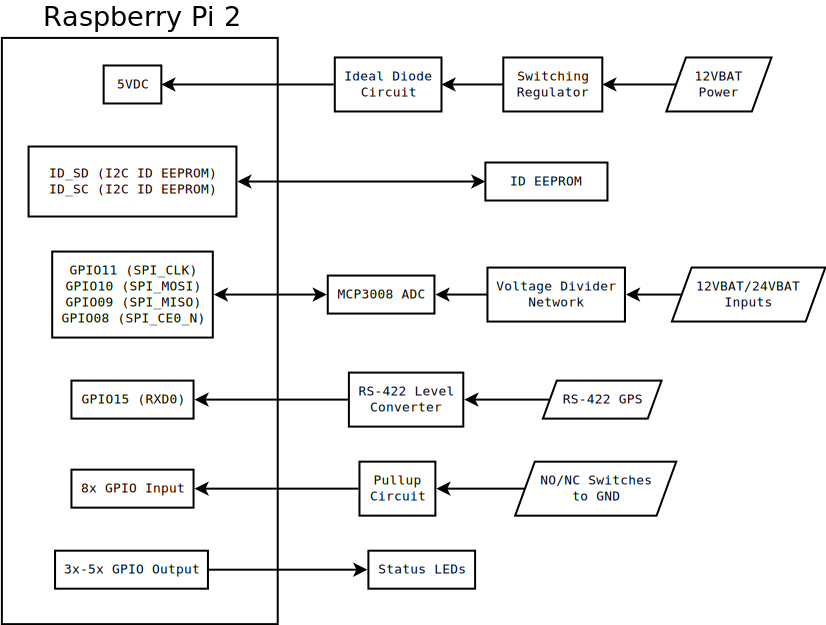

# Remote-IO (a.k.a. Pi-Dock )
_A Raspberry Pi breakout board for monitoring boat electronics_

**Patrick Lloyd in cahoots with Mirage Manufacturing**

##  Overview

### Power
* Input: 12V deep cycle marine battery (so somewhere between 10V to 13V). Regulate to 5V for back-powering the Pi through custom HAT
* 3V3 for peripherals is taken care of by Pi's on-board LDO
* Regulator: 3A buck regulator. Pi requires 1.3A at all times but recommended to support 2A. A 3A regulator should then be sufficient. Potential choices:
  * [TI LM2596](http://www.ti.com/lit/ds/symlink/lm2596.pdf)
  * [Micrel MIC24085](http://www.micrel.com/_PDF/MIC24085.pdf)
  * [Diodes Incorporated AP1506](http://www.diodes.com/datasheets/AP1506.pdf)
* More or less and an implementation of the application example circuit in the [HAT Design Guide](https://github.com/raspberrypi/hats/blob/master/designguide.md#back-powering-the-pi-via-the-j8-gpio-header)
* Raspberry Pi suggests an [ideal safety diode](https://github.com/raspberrypi/hats/blob/master/zvd-circuit.png) to allow back-powering through the header while connected to USB

### Analog
* MCP3008 ADC using at least 4 channels
* Should measure 12 & 24 Volt batteries using voltage dividers and zener diodes for protection
* Max 1 Hz sample rate (which means bit bang SPI is totally sufficient)
* [Neat article about ADC voltage dividers with enables](https://web.archive.org/web/20150816035158/http://www.microbuilder.eu/Tutorials/Fundamentals/MeasuringBatteryVoltage.aspx) (Thanks Internet Archive!)

### Digital
* Monitor switch closures. These are going to be NO or NC switches connected to ground. Connect switches directly to GPIO and use RasPi's internal pullup resistors.
* Looking at 6-8 switch input channels. We can _very_ easily add a shift register for more pins.
* GPS that talks unidirectionally to Pi over UART. Needs an RS422 level translator.
* Isolated CAN bus transceiver
* Status LEDs

## EDA
* Schematic to be drawn in KiCad. See the HW folder for more details

## Software
* Raspbian Linux
* Do as much as possible in Python since there is not much timing-critical activity

## Mechanical Design
* RemoteIO is to be implemented as a **Raspberry Pi 2 HAT**
* All input connections are going to made with screw terminals
* It should include 4 mounting holes for #8 fasteners.
* [This guy](https://github.com/disk91/hat-design) built some B+ hat templates with built-in eeprom and [has some tutorials](http://www.disk91.com/2015/technology/hardware/design-a-raspberry-pi-hat-shield/) on how to flash it and interface with it as per the Raspi [recommended guidelines](https://github.com/raspberrypi/hats).
